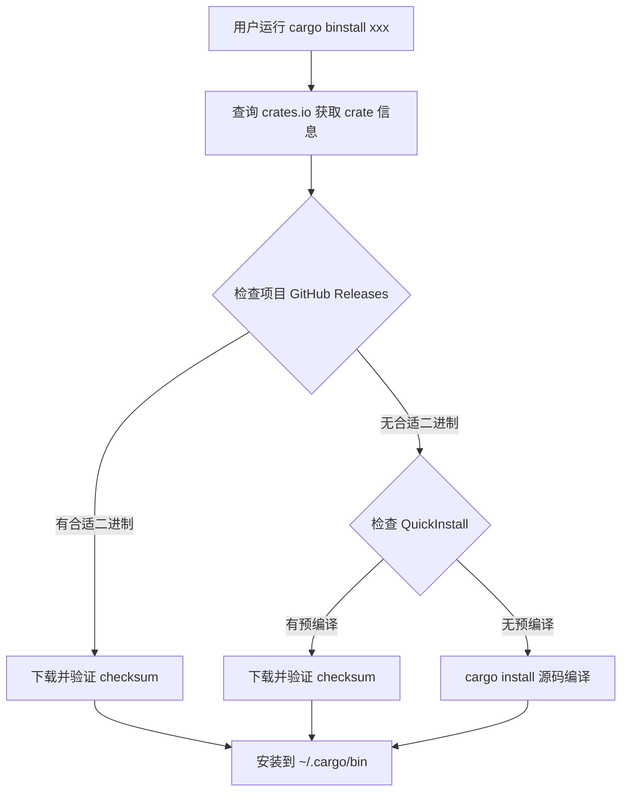

# cargo-binstall 下载机制与安全审计文档

**文档版本：** 1.0  
**更新日期：** 2026-03-28  
**目的：** 验证 cargo-binstall 的下载机制和安全保障，评估供应链攻击风险

---

## 1. 下载机制

### 1.1 下载源优先级

```
cargo binstall <crate>
       ↓
┌─────────────────────────────────────────────────────────────┐
│  下载源优先级（依次尝试，成功则停止）                        │
├─────────────────────────────────────────────────────────────┤
│                                                             │
│  1️⃣ 项目官方 GitHub Releases（最高优先级）                   │
│     检查：https://github.com/<user>/<repo>/releases         │
│     条件：匹配当前平台架构的预编译二进制                      │
│     示例：github.com/sharkdp/fd/releases/...                │
│                                                             │
│  2️⃣ QuickInstall（第三方预编译仓库）                         │
│     检查：github.com/cargo-bins/cargo-quickinstall/releases │
│     条件：社区为该 crate 构建了预编译二进制                    │
│     示例：github.com/cargo-bins/cargo-quickinstall/.../bat  │
│                                                             │
│  3️⃣ cargo install（源码编译，最后手段）                      │
│     来源：https://crates.io                                 │
│     条件：上述都失败时回退                                   │
│     耗时：数分钟到数十分钟                                   │
│                                                             │
└─────────────────────────────────────────────────────────────┘
```

### 1.2 下载流程图



### 1.3 实际验证命令

```bash
# 验证 1: 查看下载源（使用 --dry-run 预览）
cargo binstall gitui --dry-run

# 验证 2: 查看实际安装日志
cargo binstall gitui --force --no-confirm 2>&1 | grep -E "from|source|QuickInstall"

# 验证 3: 检查项目是否有 GitHub Releases
curl -sL "https://api.github.com/repos/extrawurst/gitui/releases/latest" | jq '.assets[].name'

# 验证 4: 检查 QuickInstall 是否有预编译
curl -sL "https://api.github.com/repos/cargo-bins/cargo-quickinstall/releases?per_page=100" | jq -r '.[].tag_name' | grep gitui
```

---

## 2. 安全保障机制

### 2.1 安全机制总览

| 机制 | 状态 | 说明 |
|------|------|------|
| **HTTPS + TLS 1.2+** | ✅ 强制 | 下载过程加密，防中间人攻击 |
| **crates.io checksum 验证** | ✅ 强制 | 验证 crate tar 的 SHA256 |
| **版本匹配检查** | ✅ 强制 | 确保 binary 与 crate 版本一致 |
| **签名验证 (minisign)** | 🟡 可选 | 需要 crate 配置公钥 |
| **不执行任意代码** | ✅ 设计 | 相比 `curl | sh` 更安全 |

### 2.2 详细安全机制

#### 2.2.1 HTTPS + TLS 1.2+

```rust
// cargo-binstall 强制使用 HTTPS
// 代码位置：binstalk/src/ops/resolve.rs
let url = Url::parse("https://...")?;
let client = Client::builder()
    .https_only(true)  // 强制 HTTPS
    .min_tls_version(TLS_1_2)  // 最低 TLS 1.2
    .build()?;
```

**验证命令：**
```bash
# 验证下载是否使用 HTTPS
cargo binstall bat --dry-run 2>&1 | grep "https://"
```

---

#### 2.2.2 crates.io checksum 验证

```toml
# crates.io 上的每个 crate 都有 SHA256 checksum
# 位置：https://crates.io/api/v1/crates/bat/0.26.1
{
  "checksum": "abc123..."
}
```

**验证流程：**
```
1. 从 crates.io 获取 crate 元数据（包含 checksum）
2. 下载二进制文件
3. 计算下载文件的 SHA256
4. 与 crates.io 的 checksum 对比
5. 不匹配则拒绝安装
```

**验证命令：**
```bash
# 获取 crates.io 上的 checksum
curl -sL "https://crates.io/api/v1/crates/gitui/0.28.1" | jq '.version.checksum'

# 手动验证（如果知道下载 URL）
curl -sL "https://..." -o /tmp/gitui.tar.gz
sha256sum /tmp/gitui.tar.gz
# 对比两个 checksum 是否一致
```

---

#### 2.2.3 版本匹配检查

```rust
// cargo-binstall 会验证下载的 binary 版本与请求的 crate 版本一致
// 代码位置：binstalk/src/ops/resolve.rs
if downloaded_version != requested_version {
    return Err(Error::VersionMismatch);
}
```

**验证命令：**
```bash
# 安装指定版本
cargo binstall gitui@0.28.1 --no-confirm

# 验证安装的版本
gitui --version
# 应该输出：gitui 0.28.1
```

---

#### 2.2.4 签名验证 (minisign) - 可选

```toml
# crate 维护者可以在 Cargo.toml 中配置签名
[package.metadata.binstall.signing]
algorithm = "minisign"
pubkey = "RWRnmBcLmQbXVcEPWo2OOKMI36kki4GiI7gcBgIaPLwvxe14Wtxm9acX"
```

**验证流程：**
```
1. 下载二进制文件：xxx.tar.gz
2. 下载签名文件：xxx.tar.gz.sig
3. 使用公钥验证签名
4. 显示验证结果（包括 trusted comment）
```

**验证命令：**
```bash
# 查看是否有签名验证日志
cargo binstall gitui --force --no-confirm 2>&1 | grep -i "sign\|verif"

# 强制要求签名（如果 crate 配置了）
cargo binstall gitui --only-signed

# 跳过签名验证（不推荐，仅调试用）
cargo binstall gitui --skip-signatures
```

---

### 2.3 安全机制对比

| 下载方式 | HTTPS | Checksum | 签名 | 版本检查 | 不执行代码 |
|----------|-------|----------|------|----------|------------|
| **cargo binstall** | ✅ | ✅ | 🟡 | ✅ | ✅ |
| **GitHub Releases 手动** | ✅ | ❌ | ❌ | ❌ | ✅ |
| **cargo install** | ✅ | ✅ | ❌ | ✅ | ❌ (执行 build.rs) |
| **curl | sh** | 🟡 | ❌ | ❌ | ❌ | ❌ |

---

## 3. 供应链攻击风险评估

### 3.1 潜在攻击路径

```
┌─────────────────────────────────────────────────────────────┐
│  供应链攻击路径分析                                         │
├─────────────────────────────────────────────────────────────┤
│                                                             │
│  路径 1: crates.io 被攻破                                   │
│  风险：攻击者替换 crate 源码或 checksum                      │
│  缓解：crates.io 有多重验证，难度极高                        │
│                                                             │
│  路径 2: 项目 GitHub 账号被入侵                             │
│  风险：攻击者上传恶意二进制到 Releases                       │
│  缓解：GitHub 有二步验证，但仍有可能                         │
│                                                             │
│  路径 3: QuickInstall 被攻破                                │
│  风险：攻击者上传恶意预编译二进制                            │
│  缓解：签名验证（如果启用）                                  │
│                                                             │
│  路径 4: CI/CD 被入侵                                       │
│  风险：编译过程中注入恶意代码                                │
│  缓解：最小权限原则，审计构建日志                            │
│                                                             │
│  路径 5: 依赖项被投毒                                       │
│  风险：传递依赖包含恶意代码                                  │
│  缓解：cargo audit 定期扫描                                  │
│                                                             │
└─────────────────────────────────────────────────────────────┘
```

### 3.2 风险等级评估

| 攻击路径 | 可能性 | 影响 | 风险等级 | 缓解措施 |
|----------|--------|------|----------|----------|
| crates.io 被攻破 | 🟢 极低 | 🔴 高 | 🟡 中 | crates.io 安全审计 |
| GitHub 账号入侵 | 🟡 中 | 🔴 高 | 🟠 中高 | GitHub 二步验证 |
| QuickInstall 被攻破 | 🟡 中 | 🟡 中 | 🟡 中 | 签名验证 |
| CI/CD 被入侵 | 🟡 中 | 🟡 中 | 🟡 中 | 最小权限 |
| 依赖项投毒 | 🟢 低 | 🟡 中 | 🟢 低 | cargo audit |

---

### 3.3 实际验证命令

```bash
# 验证 1: 检查 crate 是否有安全审计
cargo audit  # 需要安装 cargo-audit

# 验证 2: 查看 crate 的依赖树
cargo tree -p gitui

# 验证 3: 检查项目是否有签名配置
curl -sL "https://raw.githubusercontent.com/extrawurst/gitui/master/Cargo.toml" | grep -A10 "signing\|binstall"

# 验证 4: 检查 QuickInstall 的签名文件
curl -sI "https://github.com/cargo-bins/cargo-quickinstall/releases/download/gitui-0.28.1-x86_64-unknown-linux-gnu/gitui-0.28.1-x86_64-unknown-linux-gnu.tar.gz.sig"
# 200 = 有签名，404 = 无签名
```

---

## 4. 最佳实践建议

### 4.1 个人开发者

```bash
# 推荐：使用默认配置（平衡速度和安全）
cargo binstall gitui

# 更保守：只安装签名的包
cargo binstall gitui --only-signed

# 最安全：源码编译（慢但可信）
cargo install gitui
```

### 4.2 企业/生产环境

```bash
# 方案 A: 内部镜像 + 手动验证
# 1. 从官方 Releases 下载
# 2. 验证 GPG 签名（如果提供）
# 3. 上传到内部制品库
# 4. 从内部制品库安装

# 方案 B: 锁定版本 + 审计
cargo binstall gitui@0.28.1 --only-signed
cargo audit
```

### 4.3 CI/CD 集成

```yaml
# GitHub Actions 示例
- name: Install gitui
  run: |
    # 使用 cargo binstall（快速）
    cargo binstall gitui --no-confirm
    
    # 或者使用 cargo install（慢但安全）
    # cargo install gitui --locked
    
    # 验证安装
    gitui --version
```

---

## 5. 验证清单

### 5.1 下载机制验证

- [ ] 验证 1: cargo binstall 优先从项目 Releases 下载
- [ ] 验证 2: 项目 Releases 失败后回退到 QuickInstall
- [ ] 验证 3: QuickInstall 失败后回退到 cargo install
- [ ] 验证 4: 所有下载都使用 HTTPS

### 5.2 安全机制验证

- [ ] 验证 5: crates.io checksum 被验证
- [ ] 验证 6: 版本匹配检查生效
- [ ] 验证 7: 签名验证（如果 crate 配置了）
- [ ] 验证 8: 不执行任意代码（相比 curl | sh）

### 5.3 风险评估验证

- [ ] 验证 9: 检查 crate 是否有安全漏洞（cargo audit）
- [ ] 验证 10: 检查项目是否活跃维护
- [ ] 验证 11: 检查 QuickInstall 是否有签名文件
- [ ] 验证 12: 检查 CI/CD 是否安全

---

## 6. 参考资源

### 6.1 官方文档

- cargo-binstall: https://github.com/cargo-bins/cargo-binstall
- QuickInstall: https://github.com/cargo-bins/cargo-quickinstall
- 签名验证: https://github.com/cargo-bins/cargo-binstall/blob/main/SIGNING.md
- 安全讨论: https://github.com/cargo-bins/cargo-binstall/issues/1

### 6.2 统计仪表板

- QuickInstall 统计: https://alsuren.grafana.net/public-dashboards/12d4ec3edf2548a1850a813e00592b53

### 6.3 安全工具

- cargo-audit: https://github.com/rustsec/rustsec
- cargo-deny: https://github.com/EmbarkStudios/cargo-deny

---

## 7. 结论

### 7.1 安全性评估

| 方面 | 评估 | 说明 |
|------|------|------|
| **下载安全** | 🟢 良好 | HTTPS + checksum 验证 |
| **签名验证** | 🟡 可选 | 需要维护者配置 |
| **供应链风险** | 🟡 中等 | 依赖多个信任点 |
| **相比 cargo install** | 🟢 更安全 | 不执行 build.rs |
| **相比 curl \| sh** | 🟢 更安全 | 不执行任意代码 |

### 7.2 推荐使用场景

| 场景 | 推荐方式 | 理由 |
|------|----------|------|
| **个人开发** | cargo binstall | 速度快，风险可接受 |
| **关键工具** | cargo install | 源码编译，完全可信 |
| **生产环境** | 手动验证 + 内部镜像 | 最大控制 |
| **CI/CD** | cargo binstall --only-signed | 平衡速度和安全 |

### 7.3 最终建议

✅ **推荐使用 cargo binstall**，但需了解：

1. 它依赖多个信任点（crates.io + GitHub + QuickInstall）
2. 签名验证是可选的，不是所有 crate 都配置
3. 对于关键工具，建议源码编译或手动验证
4. 定期运行 `cargo audit` 检查依赖漏洞

---

**文档结束**
